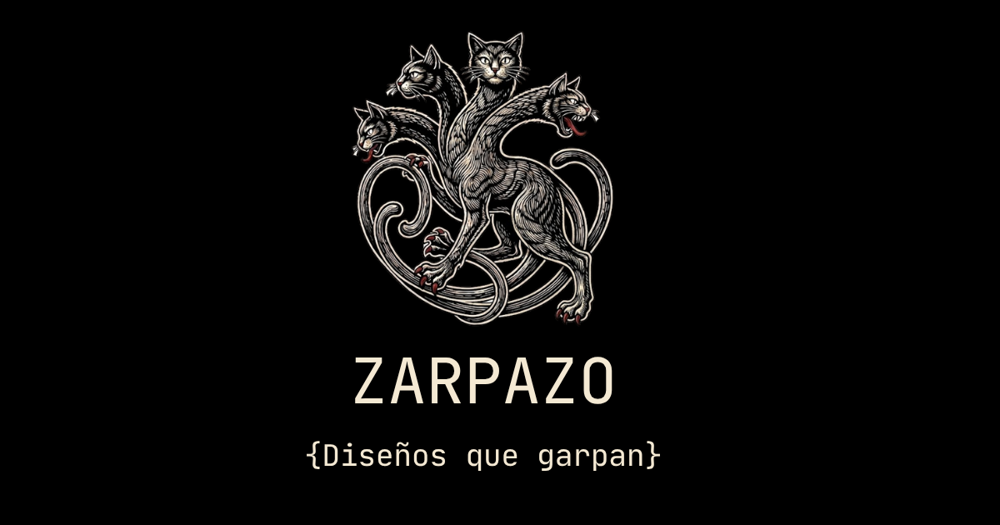

# Zarpazo


Frontend de [zarpazo.art](https://zarpazo.art) — marca argentina de remeras estampadas bajo demanda.

## Arquitectura

```
zarpazo.art (este repo — Vercel)
    ↓ fetch ISR revalidate: 3600s
api.zarpazo.art (zarpazo-backend — Fly.io)
    ↓ imágenes
Vercel Blob CDN
```

## Stack

| Capa | Tecnología |
|---|---|
| Framework | Next.js 16 (App Router) |
| UI | React 19 + Tailwind CSS v4 + shadcn/ui |
| Lenguaje | TypeScript 5 |
| Fuentes | Space Mono · Space Grotesk · Geist Mono |
| Analytics | Vercel Analytics + Google Analytics 4 |
| Deploy | Vercel (auto-deploy desde `main`) |
| Imágenes | Vercel Blob CDN (`*.public.blob.vercel-storage.com`) |
| API | `https://api.zarpazo.art` (Express + SQLite) |

## URLs

| Entorno | URL |
|---|---|
| Producción | https://zarpazo.art |
| API backend | https://api.zarpazo.art |
| Admin panel | https://api.zarpazo.art/admin |

## Variables de entorno

```bash
NEXT_PUBLIC_API_URL=https://api.zarpazo.art   # URL del backend (fallback: https://zarpazo-backend.fly.dev)
NEXT_PUBLIC_GA_ID=G-XXXXXXXXXX                # Google Analytics 4 Measurement ID
REVALIDATE_TOKEN=                              # clave compartida con el backend para ISR
```

## Primeros pasos

```bash
npm install
npm run dev   # http://localhost:3000
```

## Comandos

```bash
npm run dev        # desarrollo con hot reload
npm run build      # build de producción
npm run lint       # ESLint
```

## Rutas

| Ruta | Tipo | Descripción |
|---|---|---|
| `/` | ISR 1h | Home: hero, promo-slider, carousel, showcase, grilla Instagram, FAQ, CTAs |
| `/catalogo` | SSG + ISR 1h | Catálogo filtrable y buscable |
| `/product/[slug]` | SSG + ISR 1h | Detalle de producto |
| `/guia-de-talles` | SSG | Guía de medidas |
| `/nosotros` | SSG | Historia y valores de la marca |
| `/contacto` | SSG | Canales de contacto |
| `/legal` | SSG | Devoluciones, privacidad y términos (no indexada por robots) |
| `/api/revalidate` | Dynamic | Webhook ISR (llamado por el backend) |

## Fetch de datos

Productos y categorías vienen del backend en tiempo de build y se revalidan cada hora (ISR).

```typescript
// src/lib/api.ts
const [products, categories] = await Promise.all([
  getProducts(),    // GET /api/products   — ISR 1h
  getCategories(),  // GET /api/categories — ISR 1h
])
```

Cuando se crea/edita un producto en el admin panel, el backend llama automáticamente a `/api/revalidate` y Next.js regenera las páginas afectadas sin redeploy.

### Categorías dinámicas

Las categorías se obtienen de la API, no de un archivo hardcodeado. `CatalogGrid` recibe la lista como prop y construye los filtros y los labels en tiempo de render. Agregar o renombrar una categoría desde `/admin/categories` se refleja en el catálogo en la siguiente revalidación ISR (≤ 1 hora), sin redeploy.

```
GET /api/categories → [{ key, label, sortOrder }]
    ↓ catalogo/page.tsx (server component)
    ↓ CatalogGrid (recibe categories prop)
    ↓ CatalogFilters (botones de filtro)
       getCategoryLabel (lookup local por key)
```

`src/data/categories.ts` se mantiene para la sección de productos del home (datos estáticos locales). No es la fuente de verdad del catálogo.

## Lighthouse

Score 100/100 en todas las categorías (mobile y desktop):

| Categoría | Score |
|---|---|
| Performance | 100 |
| Accessibility | 100 |
| Best Practices | 100 |
| SEO | 100 |

**Optimizaciones clave:**
- YouTube facade pattern: thumbnail via `/_next/image`, iframe solo al hacer click
- Instagram grid: fotos propias en `public/instagram/` servidas por Next.js Image — cero scripts de terceros
- Fuentes con `display: "swap"`
- `imageSizes: [16,32,48,64,96,128,256,384]` en `next.config.ts`
- Contraste WCAG AA auditado en todos los componentes

## Estructura del proyecto

```
public/
  brand/
    zarpazo-logo.png
  instagram/               ← fotos UGC (800×800 WebP) — servidas por Next.js Image
    foto-1.webp … foto-6.webp
  reviews/                 ← fotos de clientes con producto (800×800 WebP)
    review-1.webp … review-4.webp
  categorydiscovery/       ← imágenes hero por categoría (800×800 WebP, sin fondo)
    ct1.webp … ct3.webp
  products/[slug]/         ← imágenes locales (referencia; CDN en producción)
  opengraph-image.png      ← social preview 1200×630
  favicon.ico
  site.webmanifest

src/
  app/
    layout.tsx             ← metadata global, fuentes, analytics
    page.tsx               ← home (server component, fetch productos)
    catalogo/page.tsx      ← server component, lee searchParams.categoria, fetch productos + categorías
    product/[slug]/
      page.tsx             ← generateStaticParams + fetch por slug
    nosotros/page.tsx
    guia-de-talles/page.tsx
    contacto/page.tsx
    api/revalidate/
      route.ts             ← webhook ISR del backend

  lib/
    api.ts                 ← getProducts() / getProductBySlug() / getCategories() con ISR

  components/
    layout/
      navbar, footer, announcement-bar
      tab-title-hook.tsx   ← parpadeo "Volvé a Zarpazo 🐱" al cambiar de pestaña
      cookie-banner.tsx    ← banner de consentimiento + carga condicional de GA4
    home/
      category-discovery.tsx ← sección de categorías con draft por card, links a /catalogo?categoria=X
      reviews-section.tsx    ← prueba social con draft por review, datos en src/data/reviews.ts
      instagram-grid.tsx     ← grilla 6 fotos UGC, hover effect, links a posts IG
      promo-slider.tsx       ← slider promocional (hoodies, personalizados, talle mujer)
      ...                    ← hero, carousel, product-layer-showcase, ...
    catalogo/
      catalog-grid.tsx     ← recibe products + categories + initialCategory; filtros y búsqueda client-side
      catalog-filters.tsx  ← botones de categoría desde prop (dinámico)
      catalog-search.tsx
      catalog-header.tsx
    product/
      product-actions.tsx    ← coordinador: color/talle/zoom; slide animado con Framer Motion
      product-image-zoom.tsx ← modal de zoom con AnimatePresence, ESC, backdrop click, X button
      color-selector.tsx
      size-selector.tsx
      whatsapp-button.tsx
      related-products.tsx
    ui/
      ProductCard.tsx      ← card reutilizable compartida por CatalogGrid y RelatedProducts
      PriceTag.tsx
      WhatsAppFloat.tsx
      button.tsx

  data/
    config.ts              ← contacto, marca, URLs, YouTube
    reviews.ts             ← datos de reviews con flag draft por entrada
    category-discovery.ts  ← datos de categorías del home con flag draft por card
    categories.ts          ← lista estática para el home (no es fuente del catálogo)
    faq.json               ← preguntas frecuentes editables sin tocar componentes
    promo-slides.ts        ← tipos + datos del PromoSlider (banners del home)
    home-showcase.json
    size-guide.json

scripts/
  validate-data.ts         ← prebuild: valida datos estáticos
```

## SEO y Social Preview

- Metadata global en `src/app/layout.tsx` (OG, Twitter Card)
- `metadataBase`: `https://www.zarpazo.art`
- OG image: `public/opengraph-image.png` (1200×630px)
- `robots.ts` y `sitemap.ts` presentes (sitemap generado desde la API)

## Analytics

- `@vercel/analytics` — server-side, no bloqueado por ad blockers, no requiere consentimiento
- GA4 (`G-0XY9DXNLBQ`) — cargado condicionalmente desde `CookieBanner` solo si el usuario acepta cookies. El consentimiento se guarda en `localStorage` (`zarpazo_cookie_consent`).
- `@next/third-parties/google` removido del layout — GA ya no se carga sin consentimiento.

## Despliegue (Vercel)

Auto-deploy desde `main`. Variables de entorno configuradas en el dashboard de Vercel.

`next.config.ts` incluye `*.public.blob.vercel-storage.com` en `remotePatterns` para las imágenes del CDN.

## Mantenimiento mensual

```bash
npm outdated
npm audit
npm run lint
npm run build
```

Verificar Lighthouse en producción y confirmar 100/100/100/100.

## Registro de cambios

| Fecha | Cambio |
|---|---|
| 2026-06-19 | `CategoryDiscovery`: nueva sección en home debajo del Hero con tarjetas por categoría. Cada card linkea a `/catalogo?categoria=X`. Draft flag por card en `src/data/category-discovery.ts`. Server Component puro, hover con Tailwind `group`. |
| 2026-06-19 | Filtrado por URL en catálogo: `CatalogoPage` lee `searchParams.categoria` y lo pasa como `initialCategory` a `CatalogGrid`. `/catalogo?categoria=gatos` ahora aterriza con el filtro activo. |
| 2026-06-19 | `ReviewsSection`: sección de prueba social con 4 reviews de clientes. Draft flag por review en `src/data/reviews.ts`. La sección no aparece si todos son draft. Server Component, Lighthouse 100 intacto. |
| 2026-06-19 | `ProductImageZoom`: modal de zoom en página de producto. Click en imagen abre zoom full-screen. Cierre por ESC, click en backdrop o botón X. `body.overflow` bloqueado mientras está abierto. Animación fade + scale con Framer Motion `AnimatePresence`. |
| 2026-06-19 | Thumbnails de color bajo imagen de producto: al tener variantes de color, aparecen miniaturas clickeables debajo de la imagen principal. Click en thumbnail anima con dirección correcta. |
| 2026-06-19 | Slide animado entre variantes de color: flechas `‹` `›` sobre la imagen con `ChevronLeft`/`ChevronRight` de Lucide. Cambio de color animado con Framer Motion `AnimatePresence` (slide direccional izquierda/derecha, 280ms). Swipe táctil circular (wrap-around). `framer-motion` agregado al proyecto. |
| 2026-06-19 | Fix hidratación `CookieBanner`: `useState` arranca con `visible: false`, `useEffect` lee `localStorage` post-mount. Elimina el mismatch server/client que causaba el error de hidratación. |
| 2026-06-19 | `ProductCard` extraído como componente reutilizable en `src/components/ui/ProductCard.tsx`. Elimina duplicación entre `CatalogGrid` y `RelatedProducts`. Props: `product`, `categoryLabel?`, `priority?`, `sizes?`. |
| 2026-06-14 | `PromoSlider` agregado al home: slider automático con 3 banners (hoodies, diseño personalizado, talle mujer). Datos en `src/data/promo-slides.ts`, componente desacoplado en `SlideLeft` / `SlideRight` / `NavDots`. |
| 2026-06-14 | `CookieBanner`: GA4 ahora se carga solo si el usuario acepta. Consentimiento guardado en `localStorage`. `@next/third-parties/google` removido del layout. |
| 2026-06-14 | `TabTitleHook`: parpadeo "Volvé a Zarpazo 🐱" al cambiar de pestaña del navegador. |
| 2026-06-14 | `/legal` agregada: política de devoluciones (retiro Defensa 657 domingos 10-18hs), privacidad y términos. `robots: noindex`. Link en footer. |
| 2026-06-14 | FAQ: nuevas entradas sobre DTF personalizado, hoodies y remeras solo negras. |
| 2026-06-14 | `config.ts`: número de WhatsApp y URL de YouTube actualizados. |
| 2026-06-09 | `src/data/products.ts` y `src/components/home/product-grid.tsx` eliminados — código muerto, datos vienen del backend desde 2026-06-07. |
| 2026-06-09 | Archivos con sufijo " copy" eliminados de `public/` (5 PNG de favicon). |
| 2026-06-09 | README: `/` corregido de SSG a ISR 1h; fallback URL del API documentado; nota GA4 hardcodeado. |
| 2026-06-08 | Sección "La comunidad zarpazo": grilla 6 fotos UGC en `public/instagram/`, hover con ícono IG, cada foto linkea a su post. Cero scripts de terceros — Lighthouse 100 intacto. |
| 2026-06-08 | `BENCHMARK.md` agregado: análisis competitivo vs Carpincho Indumentaria y Ey Mira el Estampado. |
| 2026-06-08 | `DISCOUNT_LABEL` cambiado de "Oferta de lanzamiento" a "Oferta -10%" en `products.ts` — se propaga a todos los productos. |
| 2026-06-08 | Swipe horizontal en página de producto: deslizar izquierda/derecha sobre la imagen navega entre variantes de color. |
| 2026-06-08 | Touch targets del carrusel corregidos: botones indicadores pasan de `h-0.5` (2px) a `min-h-12` (48px) con barra visual interna — fix de Lighthouse Accessibility + Best Practices. |
| 2026-06-07 | Categorías dinámicas: `getCategories()` en `api.ts`, `CatalogGrid` y `CatalogFilters` reciben categorías como prop desde la API. |
| 2026-06-07 | `catalogo/page.tsx` hace `Promise.all([getProducts(), getCategories()])` con ISR 1h. |
| 2026-06-07 | `CategoryKey` eliminado de los componentes del catálogo — categorías son `string` dinámico. |
| 2026-06-07 | Frontend consume API en producción. `products.ts` hardcodeado reemplazado por `src/lib/api.ts`. |
| 2026-06-07 | Webhook ISR `/api/revalidate` implementado. El backend revalida el catálogo al mutar productos. |
| 2026-06-07 | Favicons renombrados (removido sufijo "copy") — corrige 404 silenciosas en webmanifest. |
| 2026-06-07 | `*.public.blob.vercel-storage.com` agregado a `remotePatterns` en `next.config.ts`. |
| 2026-06-07 | `NEXT_PUBLIC_API_URL` y `REVALIDATE_TOKEN` configurados como env vars en Vercel. |
| 2026-06-05 | Lighthouse 100/100/100/100 confirmado en producción (mobile y desktop). |
| 2026-06-05 | YouTube facade pattern: thumbnail vía `/_next/image`, iframe solo al hacer click. |
| 2026-06-05 | GA4 hardcodeado en `layout.tsx` para evitar `id=undefined` en builds de Vercel. |
| 2026-06-05 | `imageSizes` extendido y auditoría de contraste WCAG AA completada. |
| 2026-05-23 | Dominio `zarpazo.art` conectado en Vercel. |
| 2026-05-22 | Repo inicializado. |

## Referencias

- [Backend repo](https://github.com/CoachEmilio/zarpazo-backend)

## Autor

Emilio Romero — [LinkedIn](https://www.linkedin.com/in/coachemilio/) · [GitHub](https://github.com/CoachEmilio)

## Licencia

MIT © 2026 Emilio Romero — ver [LICENSE](LICENSE)
